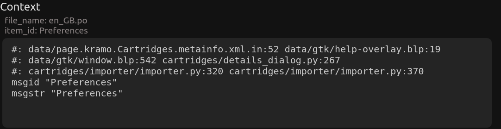

# Вілы (Vily)

Добры дзень, шаноўныя. Гэты праект з'яўляецца дапамогай аматарам перакладу гульняў на беларуску мову.

Праца з тэкставым рэдактарам складаецца з дзвюх частак:
1. Апрацоўка файлаў лакалізацыі і іх запіс у базу данных.
2. Рэдактура запісаных даных з дапамогай вэб-інтэрфейсу.

План:
1. [Частка першая](#частка-першая-апрацоўка-і-запіс)
    1. [Рашэнні з каробкі](#1-рашэнні-з-каробкі)
    2. [Трэба пісаць уласны парсер](#2-трэба-пісаць-уласны-парсер)
2. [Частка другая](#частка-другая-праца-ў-рэдактары)
    1. [Праца з радком](#праца-з-радком)
    2. [Праца з радкамі](#праца-з-радкамі)
3. [Усталёўка](#усталёўка)
4. [Планы](#планы)
5. [P.S.](#ps)

## Частка першая (апрацоўка і запіс)

### 1. Рашэнні з каробкі

#### Лакалізацыя змяшчаецца ў XML-файлах
Працуе з xml-файламі фармату:
```XML
<?xml version='1.0' encoding='UTF-8'?>
<root>
  <language id="english">
    <entry id="str_curio_no_negative_quirks_to_remove"><![CDATA[No negative quirks to remove.]]></entry>
    <entry id="str_curio_title_bandits_trapped_chest"><![CDATA[Bandit's Trapped Chest]]></entry>
  </language>
  <language id="french">
    <entry id="str_curio_no_negative_quirks_to_remove"><![CDATA[Aucun attribut négatif à supprimer.]]></entry>
    <entry id="str_curio_title_bandits_trapped_chest"><![CDATA[Coffre piégé de bandit]]></entry>
  </language>
<root>
```
1. Змясціць вашыя файлы/файл з лакалізацыяй у дырэкторыю `files_input`.
2. Запусціць backend-сервер актываваўшы перад гэтым віртуальнае асяроддзе Python
    ```bash
    (env) user@laptop:~/Vily/back$ uvicorn main:app --reload
    ```
3. Запусціць файл (пажадана мець добрае інтэрнэт-злучэнне). Стандартнае выкарыстанне праугледжвае, што скрыпт будзе шукаць у файле наступныя мовы: асноўная з id `english` і дадатковая з `russian`. У выпадку, калі вы зменіце id асноўнай мовы, то вам трэба будзе зайсці ў файл `scripts/translate.py` і змяніць змест `l_code` на код мовы, якая вам трэба (коды я браў з HTML-шкілета ў гугл перакладчыку)
    ```bash
    (env) user@laptop:~/Vily/scripts/xml$ python main_script.py
    ```
4. Пасля паспяховага сканчэння працы скрыпта можна запускаць веб-сервер. Праграма сама адкрыецца ў браўзеры (калі не, дык зайдзіце ў браўзер і пошук устаўце `http://localhost:3000/`)
    ```bash
    (env) user@laptop:~/Vily/front$ npm start
    ```
5. Па сканчэнні працы трэба дастаць даныя з базы і запісаць іх у новыя xml-файлы
    ```bash
    (env) user@laptop:~/Vily/scripts/xml$ python write_output_xml.py
    ```

#### Лакалізацыя змяшчаецца ў PO-файлах/файле
1. Змясціць вашыя файлы/файл з лакалізацыяй у дырэкторыю `files_input`.
2. Запусціць backend-сервер актываваўшы перад гэтым віртуальнае асяроддзе Python
    ```bash
    (env) user@laptop:~/Vily/back$ uvicorn main:app --reload
    ```
3. Змяніць назву po-файла ў `main_script.py` і запусціць скрыпт (пажадана мець добрае інтэрнэт-злучэнне). Стандарнае выкарыстанне прадугледжвае, што лакалізацыя змяшчаецца ў адзіным файле (калі іх некалькі, адкрыйце файл `main_script.py` і закаментуйце 14 радок і разкаментуйце 13) і ў якасці крыніцы выкарыстоўваецца адзіная мова (калі патрэбна дадатковая, трэба рэдагаваць файлы `main_script.py` і `parse_po.py`)
    ```bash
    (env) user@laptop:~/Vily/scripts/po$ python main_script.py
    ```
    У выпадку, калі вы зменіце асноўную мову, то вам трэба будзе зайсці ў файл `scripts/translate.py` і змяніць змест `l_code` на код мовы, якая вам трэба (коды я браў з HTML-шкілета ў гугл перакладчыку)

4. Пасля паспяховага сканчэння працы скрыпта можна запускаць веб-сервер. Праграма сама адкрыецца ў браўзеры (калі не, дык зайдзіце ў браўзер і пошук устаўце `http://localhost:3000/`)
    ```bash
    (env) user@laptop:~/Vily/front$ npm start
    ```
5. Па сканчэнні працы трэба дастаць даныя з базы і запісаць іх у новыя xml-файлы
    ```bash
    (env) user@laptop:~/Vily/scripts/po$ python write_output_po.py

### 2. Трэба пісаць уласны парсер
У такім выпадку вы можаце рабіць яго як заўгодна і з выкарсытаннем любых моў праграмавання, але ёсць галоўныя моманты:
1. Спачатку трэба дадаць катэгорыю. Для гэтага адпраўце POST запыт на `http://127.0.0.1:8000/api/category` з body, якое змяшчае адзінае абавязковае поле:
    ```Python
    {
        "tittle": str
    }
    ```
    Пасля паспяховай адпраўкі вы атрымаеце адказ, які змяшчае:
    ```Python
    {
        "title": str,
        "date_updated": "2024-06-03T10:02:22",
        "id": 2
    }
    ```
2. Цяпер можаце дадаваць радкі. Існуе два варыянты, як гэта зрабіць:
    1) Дасылаць кожны радок асобна. Для гэтага адпраўце POST запыт на `http://127.0.0.1:8000/api/item` з body, якое змяшчае некалькі адавязковых палёў:
        ```Python
        {
            "item_id": str,
            "first_version": str,
            "category_id": int
        }
        ```
        Таксама існуюць дадатковыя палі, які з'яўляюцца неабавязковымі:
        ```Python
        {
            "bel_version": str,
            "second_version": str,
            "readiness": bool,
            "context": str
        }
        ```
        Пасля адпраўкі вы атрымаеце адказ, які змяшчае:
        ```Python
        {
            "id": int,
            "first_version": str,
            "readiness": False,
            "date_updated": "2024-06-03T10:12:59",
            "category_id": int,
            "item_id": str,
            "bel_version": null,
            "second_version": null,
            "data_created": "2024-06-03T10:12:59",
            "context": null
        }
        ```
    2) Дасылаць некалькі радкоў разам. Для гэтага адпраўце POST запыт на `http://127.0.0.1:8000/api/items/upload` з body:
        ```Python
        [
            {
                "item_id": str,
                "first_version": str,
                "second_version": str,
                "category_id": int
            },
            {
                "item_id": str,
                "first_version": str,
                "second_version": str,
                "category_id": int
            },
            {
                "item_id": str,
                "first_version": str,
                "second_version": str,
                "category_id": int
            }
        ]
        ```


## Частка другая (праца ў рэдактары)

Тут усё значна прасцей, бо другая частка складаецца выключна з веб-праграмы. Праграма складаецца з трох відаў узаемадзеяння:
1. Праца з катэгорыямі (тут іх можна толькі выбіраць)
2. Праца з радком
3. Праца з радкамі


### Праца з радком
Складаецца з (зверху ў ніз):
1. Шапка, дзе паказаны дата апошняга рэдагавання, статус (DONE/RAW) і кнопкі навігацыі.
2. Прыклады лакалізацыі на дзвюх мовах.
3. Поле для рэдагавання. Акрамя самога поля ёсць тры кнопкі (капіраваць, ачысціць поле і захаваць)
4. Кантэкст (назва файла, адкуль узяты радок, і ключ/id па якім яго можна знайсці ў файле)

    У поле кантэкста вы можаце змясціць любыя тэкставыя даныя. Прыклад выкарыстання кантэксту ў парсеры PO-файлаў:
    

### Праца з радкамі

Тут усё як і ў катэгорый, за выключэннем таго, што тут ёсць магчымасць ажыццяўляць пошук.

1. Пошук ва ўсіх катэгорыях (зараз не працуе)
2. Пошук у бягучай катэгорыі. Калі выбраць гэты від пошуку, з'явіцца дадатковае поле з 4 варыянтамі дадатковых налад.
    1) Шукаць радкі па ключу/id
    2) Па першай мове (пакуль што ў наладах гэта англійская)
    3) Па другой мове (пакуль што ў наладах гэта руская)
    4) Па радкам з беларускай мовай
    

__!!! Падчас пошуку ігнаруюцца верхнія і ніжнія рэгістры__.

Прыклад пошуку з дадатковымі наладамі (відэа ў добрай якасці можна паглядзець `readmi_source/search.webm`):


## Усталёўка
1. Спампуйце праект любым спосабам
```bash
git clone https://github.com/BerlinerBY/Vily.git
```
2. Backend
```bash
user@laptop:~/Vily$ python -m venv env
user@laptop:~/Vily$ sourse env/bin/activate
(env) user@laptop:~/Vily$ pip install -r back/requirements.txt
(env) user@laptop:~/Vily$ playwright install firefox
``` 
3. Frontend
```bash
user@laptop:~/Vily/front$ npm install
```

## Планы

1. Дадаць пошук ва ўсіх катэгорыях.
2. Прывязаць Enter да кнопкі захавання.
3. Выправіць навігацыю па спісе радкоў з дапамогай стрэлак.
4. Падумаць над тым, каб запакаваць гэты праект у партатыўную дэсктопную праграму.
Чарга не адпавядае важнасці планаў.
5. Выпраўленне багаў.

## P.S.

Калі знойдзеце нейкія памылкі, апісвайце іх у Issues (пажадана з дакладным апісаннем і відэа)