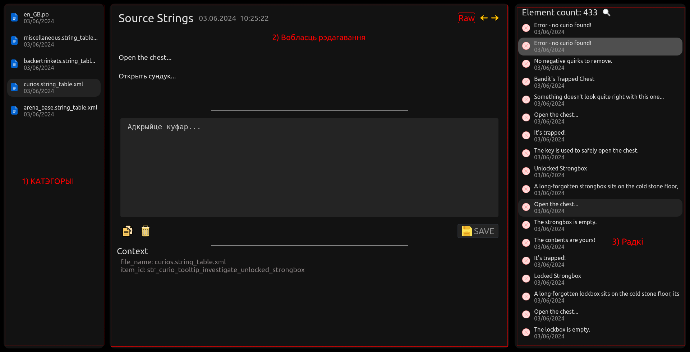

# Вілы (Vily)

Добры дзень, шаноўныя. Гэты праект з'яўляецца дапамогай аматарам перакладу гульняў на беларуску мову.

Праца з "праграмай" складаецца з дзвюх частак:
1. Апрацоўка файлаў лакалізацыі.
2. Рэдактура аўтаматычнага перакладу.

План:
1. [Частка першая](#частка-першая-scriptsxml)
2. [Частка другая](#частка-другая)
    1. [Праца з радком](#праца-з-радком)
    2. [Праца з радкамі](#праца-з-радкамі)
3. [Выкарыстанне](#выкарыстанне)
4. [Усталёўка](#усталёўка)
5. [Планы](#планы)
6. [P.S.](#ps)

## Частка першая (./scripts/xml)
### Як працуе:
1. Скануе дырэкторыю з файламі лакалізацыі
2. Па чарзе парсіць файлы
3. Аўтаматычна перакладае іх з англійскай на беларускую
4. Запісвае ў БД
5. Вымае даныя з базы

Гэтая частка праграмы пабудаваная вакол гульні Darkest Dungeon. Таму, вам, напэўна, будзе патрэбна адаптаваць яе пад сваю. Фармат лакалізацыі Darkest Dungeon:
```XML
<?xml version='1.0' encoding='UTF-8'?>
<root>
  <language id="english">
    <entry id="str_curio_no_negative_quirks_to_remove"><![CDATA[No negative quirks to remove.]]></entry>
    <entry id="str_curio_title_bandits_trapped_chest"><![CDATA[Bandit's Trapped Chest]]></entry>
  </language>
  <language id="french">
    <entry id="str_curio_no_negative_quirks_to_remove"><![CDATA[Aucun attribut négatif à supprimer.]]></entry>
    <entry id="str_curio_title_bandits_trapped_chest"><![CDATA[Coffre piégé de bandit]]></entry>
  </language>
<root>
```

Каб было прасцей, усё зроблена так, што трэба толькі перапісаць парсер (знаходзіцца ў `parse_xml_to_xlsx_and_json.py`) і экстрактар даных з БД (`write_output_xml.py`).


Аб'екты(Мадэлі):
1. Катэгорыя. У кантэксце Darkest Dungeon, катэгорыяй з'яўляецца файл з лакалізацыяй.
У БД катэгорыя мае наступныя палі:
    ```JSON
    {
        "title": "miscellaneous.string_table.xml",
        "date_updated": "2024-05-27T14:44:48",
        "id": 1
    }
    ```
    Каб самастойна стварыць новую катэгорыю дастаткова даслаць запыт на адрас `http://127.0.0.1:8000/api/category` з json фармата 
    ```JSON
    {
        "title": "your_title"
    }
    ``` 
    Поле `title` з'яўляецца адзіным абавязковым для стварэння катэгорыі.

2. Айтэм. У кантэксце Darkest Dungeon, айтэмам з'яўляецца радок у файле лакалізацыі. У БД айтэм мае наступныя палі:
    ```JSON
    {
        "eng_version": "Bandit's Trapped Chest",
        "id": 4,
        "readiness": false,
        "date_updated": "2024-03-20T16:10:49",
        "xml_id": "str_curio_title_bandits_trapped_chest",
        "bel_version": "Бандыцкі куфар з пасткай",
        "ru_version": "Сундук с ловушкой",
        "data_created": "2024-03-19T20:29:29",
        "category_id": 1
    }
    ```
    Каб самастойна стварыць новы айтэм дастаткова даслаць запыт на адрас `http://127.0.0.1:8000/api/item` з json фармата 
    ```JSON
    {
        "xml_id": "buff_rule_tooltip_monster_type_count_min",
        "eng_version": "%s vs %s",
        "ru_version": "%s в бою с противниками типа «%s»",
        "category_id": 7
    }
    ```
    Усе, прадстаўленыя ў прыкладзе палі, з'яўляюцца абавязковымі.

## Частка другая

Тут усё значна прасцей, бо другая частка складаецца выключна з веб-праграмы. Праграма складаецца з трох відаў узаемадзеяння:
1. Праца з катэгорыямі (тут іх можна толькі выбіраць)
2. Праца з радком
3. Праца з радкамі


### Праца з радком
Складаецца з (зверху ў ніз):
1. Шапка, дзе паказаны дата апошняга рэдагавання, статус (DONE/RAW) і кнопкі навігацыі.
2. Прыклады лакалізацыі на дзвюх мовах.
3. Кантэкст (назва файла, адкуль узяты радок, і ключ/id па якім яго можна знайсці ў файле)
4. Поле для рэдагавання. Акрамя самога поля ёсць тры кнопкі (капіраваць, ачысціць поле і захаваць)
5. Поле з каментарыямі да радка (зараз не працуе)


### Праца з радкамі

Тут усё як і ў катэгорый, за выключэннем таго, што тут ёсць магчымасць ажыццяўляць пошук.

1. Пошук ва ўсіх катэгорыях (зараз не працуе)
2. Пошук у бягучай катэгорыі. Калі выбраць гэты від пошуку, з'явіцца дадатковае поле з 4 варыянтамі дадатковых налад.
    1) Шукаць радкі па ключу/id
    2) Па першай мове (пакуль што ў наладах гэта англійская)
    3) Па другой мове (пакуль што ў наладах гэта руская)
    4) Па радкам з беларускай мовай
    

__!!! Падчас пошуку ігнаруюцца верхнія і ніжнія рэгістры__.

Прыклад пошуку з дадатковымі наладамі (відэа ў добрай якасці можна паглядзець `readmi_source/search.webm`):


## Выкарыстанне

Для таго, каб скарыстацца Віламі, вам трэба:
1. Змясціць вашыя файлы/файл з лакалізацыяй у дырэкторыю `files_input`.
2. Калі патрэбна, адрэдагаваць парсер у файле `parse_xml_to_xlsx_and_json.py`.
3. Запусціць backend-сервер актываваўшы перад гэтым віртуальнае асяроддзе Python
    ```bash
    (env) user@laptop:~/Vily/back$ uvicorn main:app --reload
    ```
4. Запусціць файл 
    ```bash
    (env) user@laptop:~/Vily/scripts/xml$ python main_script.py
    ```
5. Зараз можна запускаць веб-сервер. Праграма сама адкрыецца ў браўзеры (калі не, дык зайдзіце ў браўзер і пошук устаўце `http://localhost:3000/`)
    ```bash
    (env) user@laptop:~/Vily/front$ npm start
    ```

Каб выгрузіць даныя з праграмы трэба:
- Калі не змянялі парсер, проста запусціце `write_output_xml.py`
- Калі змянялі, то вам трэба змяніць і `write_output_xml.py` пад вас

## Усталёўка
1. Спампуйце праект любым спосабам
```bash
git clone https://github.com/BerlinerBY/Vily.git
```
2. Backend
```bash
user@laptop:~/Vily$ python -m venv env
user@laptop:~/Vily$ sourse env/bin/activate
(env) user@laptop:~/Vily$ pip install -r back/requirements.txt
(env) user@laptop:~/Vily$ playwright install firefox
``` 
3. Frontend
```bash
user@laptop:~/Vily/front$ npm install
```

## Планы

1. Дадаць пошук ва ўсіх катэгорыях.
2. Прывязаць Enter да кнопкі захавання.
3. Выправіць навігацыю па спісе радкоў з дапамогай стрэлак.
4. Падумаць над тым, каб запакаваць гэты праект у партатыўную дэсктопную праграму.
Чарга не адпавядае важнасці планаў.
5. Выпраўленне багаў.

## P.S.

Калі знойдзеце нейкія памылкі, апісвайце іх у Issues (пажадана з дакладным апісаннем і відэа)